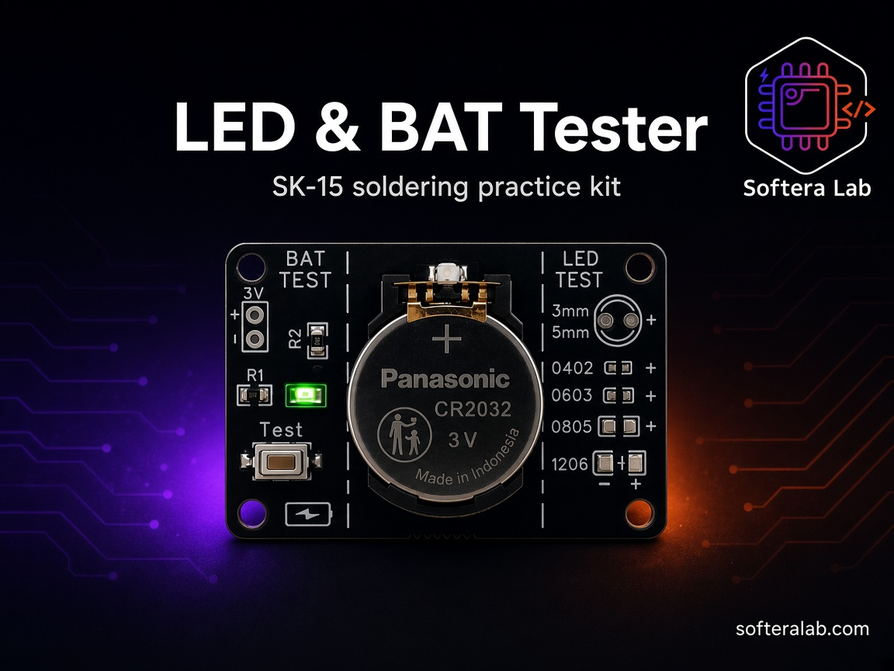
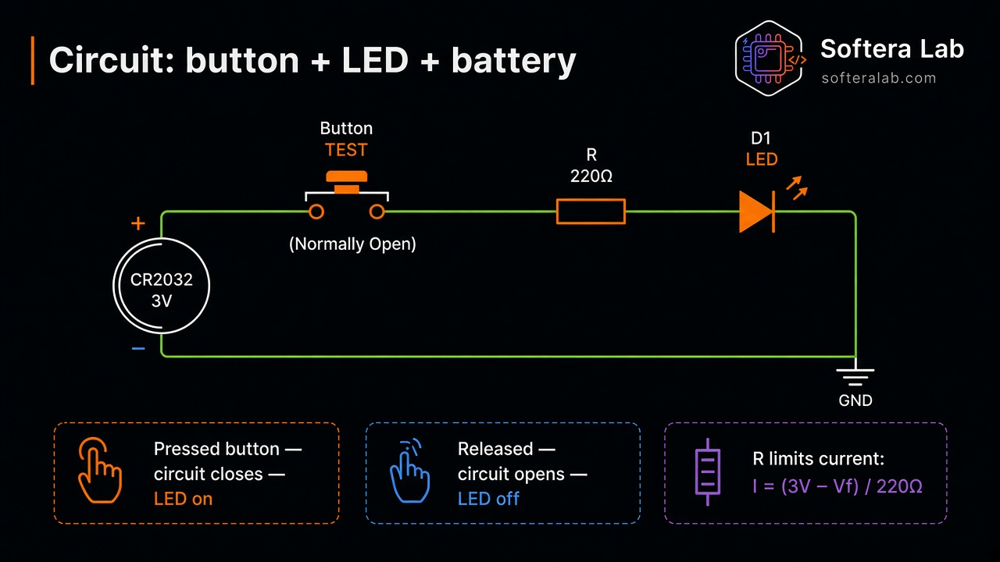
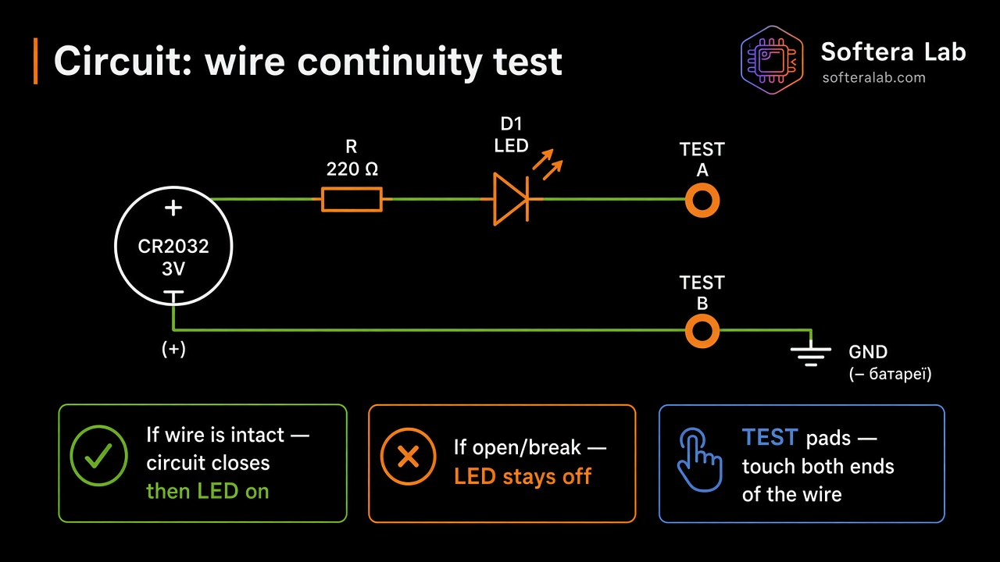
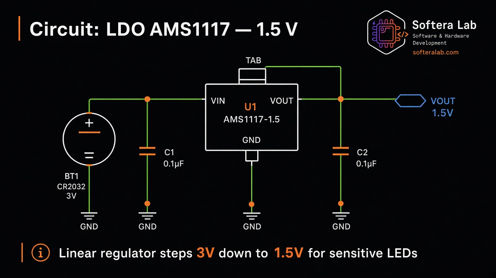
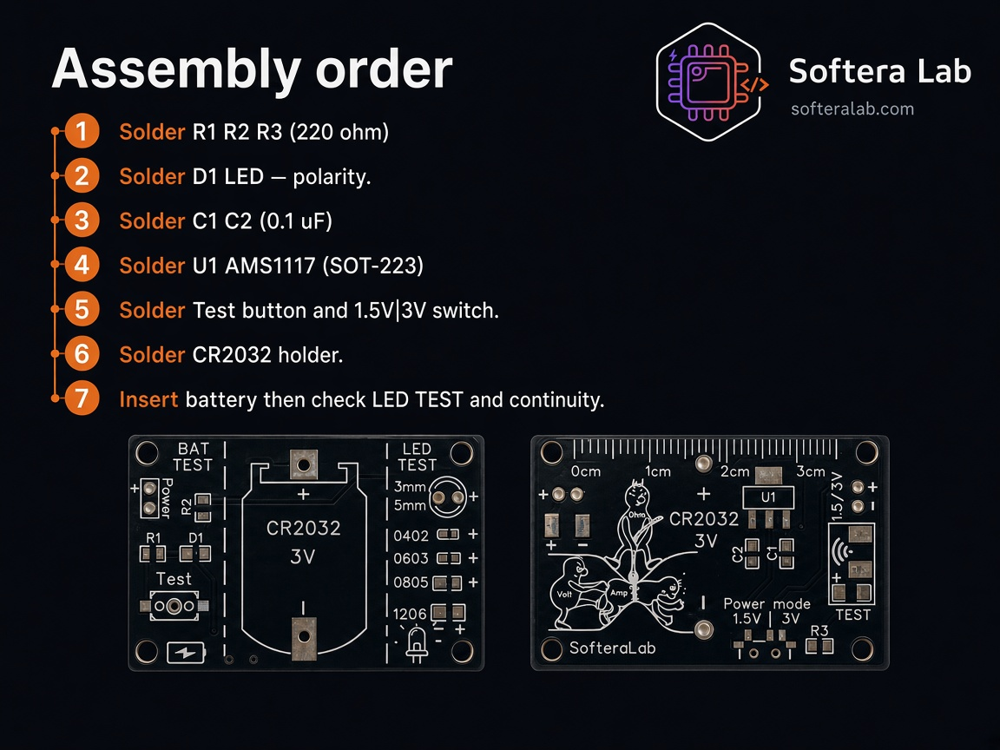

  

<h1 align="center">LED & BAT Tester · SK-15</h1>

<strong>Softera Lab soldering kit — LED and CR2032 battery tester</strong>

  
  
  
  
  

<strong>Languages:</strong> English (this page) · <a href="README.uk.md">Українська</a>

  

Softera Lab practice kit that becomes a real tool after assembly: test LEDs, check a CR2032 cell, and probe wire continuity. Product page and assembly guide for buyers and soldering-course students.

This is **not an open-source hardware project**. Manufacturing files are not published.

> © Softera Lab. All rights reserved. Copying the board or manufacturing files without written permission is prohibited.

## How it works

  

1. **CR2032 3V** — power source  
2. **AMS1117 LDO** — stable **1.5 V** rail  
3. **Switch 1.5 V | 3 V** — voltage for LED TEST  
4. **Three modes** — LED TEST · continuity · Button + LED  

## About the kit

**Solder-Kit-SMD-Led-Tester-SK15** is a double-sided practice board from [Softera Lab](https://www.softeralab.com/).

| Zone | What you get |
| --- | --- |
| **BAT TEST** | R1, R2, D1, Test button, 3 V contact pads |
| **LED TEST** | Pads for THT **3 mm / 5 mm** and SMD **0402, 0603, 0805, 1206** (observe + polarity) |
| **Power** | CR2032 holder, AMS1117-1.5, switch 1.5 V \| 3 V |
| **Continuity** | TEST pads on the second side |
| **Extra** | 0–3 cm ruler on the board edge |

There is **no microcontroller**. The circuit is discrete: battery, LDO, resistors, LED, switch, and button.

  

  

## Specifications

| Parameter | Value |
| --- | --- |
| Product | LED & BAT Tester · SK-15 |
| Full name | Solder-Kit-SMD-Led-Tester-SK15 |
| Supply | CR2032, 3 V |
| Regulated rail | AMS1117-1.5 → 1.5 V |
| LED TEST voltage | Switch **1.5 V \| 3 V** |
| LED pads | 3 mm, 5 mm, 0402, 0603, 0805, 1206 |
| Modes | LED TEST, wire continuity, Button + LED |
| MCU | None |

## What's in the kit

  

1. **R1, R2, R3** — 220 ohm (code 221)  
2. **D1** — LED  
3. **C1, C2** — 0.1 uF (100 nF), 0805  
4. **U1** — AMS1117-1.5, LDO, SOT-223  
5. **CR2032** holder, 3 V  
6. **Switch** — power mode 1.5 V \| 3 V (3 pins)  
7. **Test** button  
8. **LED TEST** pads — 3 mm, 5 mm, 0402, 0603, 0805, 1206  

## Circuit ideas (training cards)

### Button + LED + battery

  

Press Test → circuit closes → LED on. Release → LED off.  
Current limit: `I = (3V - Vf) / 220ohm`.

### Wire continuity

  

Touch both ends of a wire to **TEST** pads. Intact wire → LED on. Open wire → LED off.

### LDO AMS1117 — 1.5 V

  

Linear regulator steps **3 V → 1.5 V** for sensitive LEDs (with C1 / C2 0.1 uF).

## Assembly (short)

Full guide: [docs/02-getting-started.md](docs/02-getting-started.md).

  

1. Solder **R1, R2, R3** (220 ohm)  
2. Solder **D1** LED — **polarity!**  
3. Solder **C1, C2** (0.1 uF)  
4. Solder **U1 AMS1117** (SOT-223)  
5. Solder **Test** button and **1.5 V \| 3 V** switch  
6. Solder **CR2032** holder  
7. Insert battery → check **LED TEST** and continuity  

## Links

| Item | Where |
| --- | --- |
| Ukrainian README | [README.uk.md](README.uk.md) |
| Hardware overview | [docs/01-hardware-overview.md](docs/01-hardware-overview.md) |
| Assembly | [docs/02-getting-started.md](docs/02-getting-started.md) |
| How to use | [docs/03-usage.md](docs/03-usage.md) |
| Troubleshooting | [docs/04-troubleshooting.md](docs/04-troubleshooting.md) |
| Website | [softeralab.com](https://www.softeralab.com/) |
| Soldering course | [course page](https://www.softeralab.com/course-basic-soldering/) |
| Contact | [Contacts](https://www.softeralab.com/our-contacts/) · support@softeralab.com |
| Instagram | [instagram.com/softeralab](https://www.instagram.com/softeralab/) |
| YouTube | [youtube.com/@SofteraLab](https://www.youtube.com/@SofteraLab) |

## Copyright

© Softera Lab. All rights reserved.

Public materials may be viewed. You may not copy, manufacture, redistribute, or commercially use the board design without written permission from Softera Lab.
