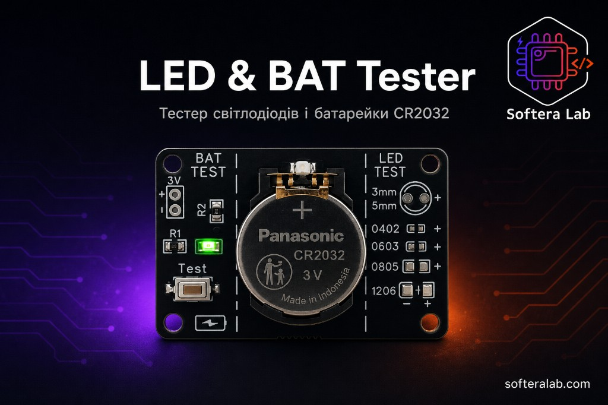
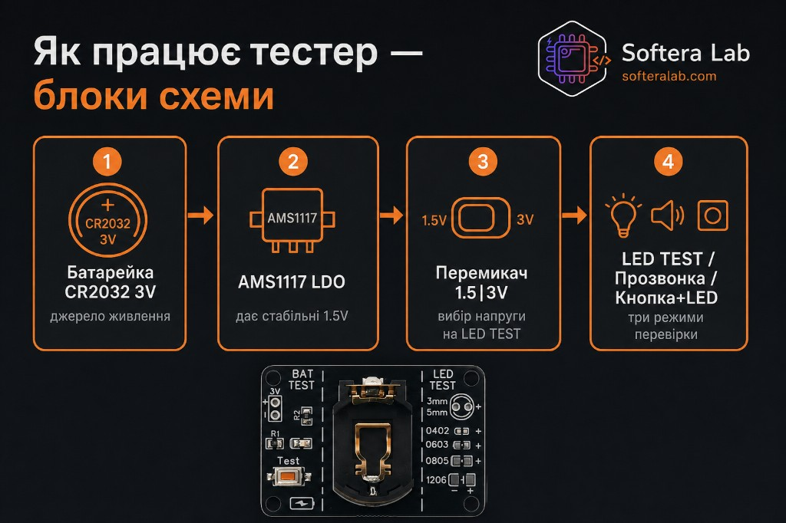
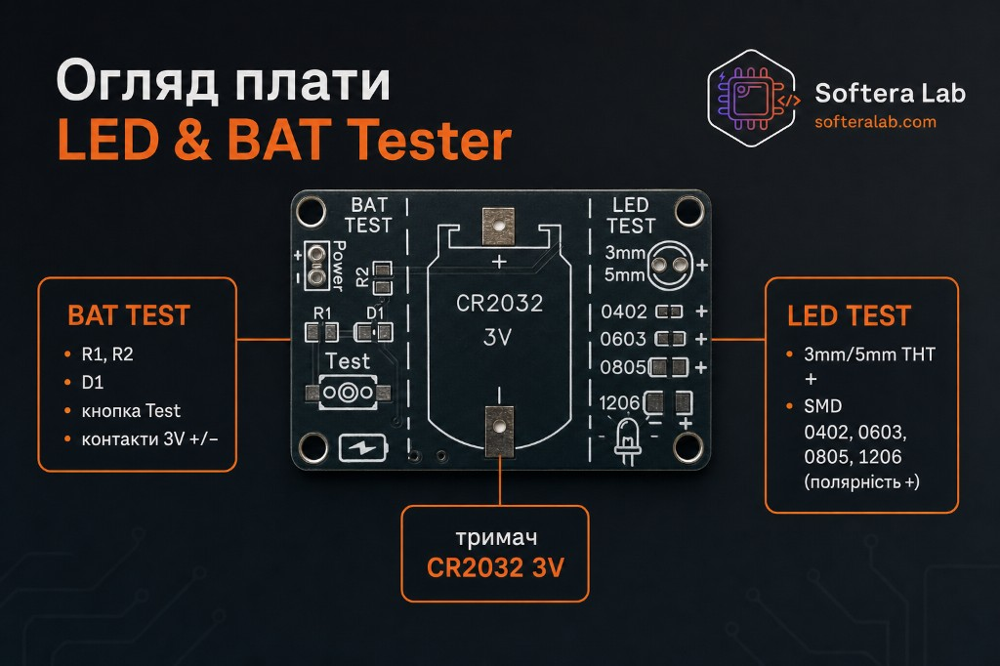
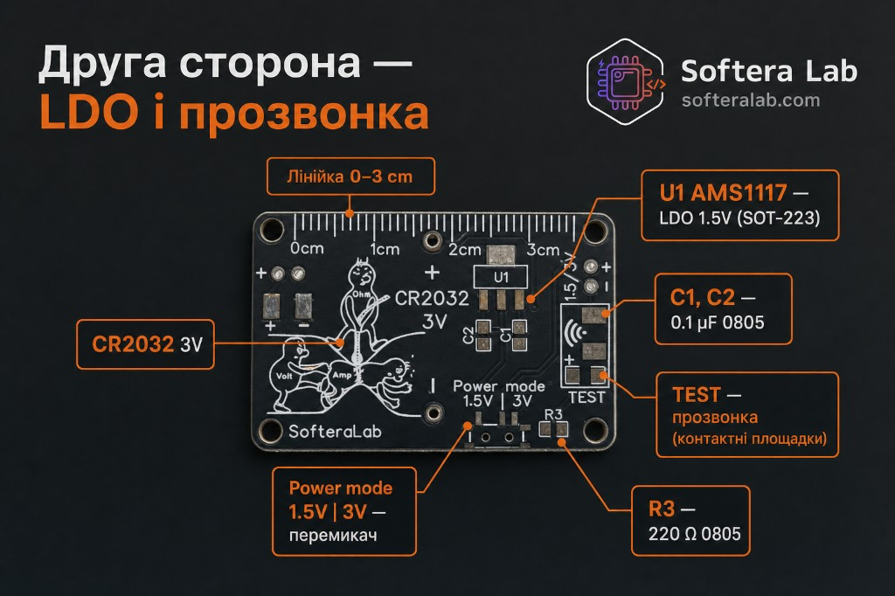
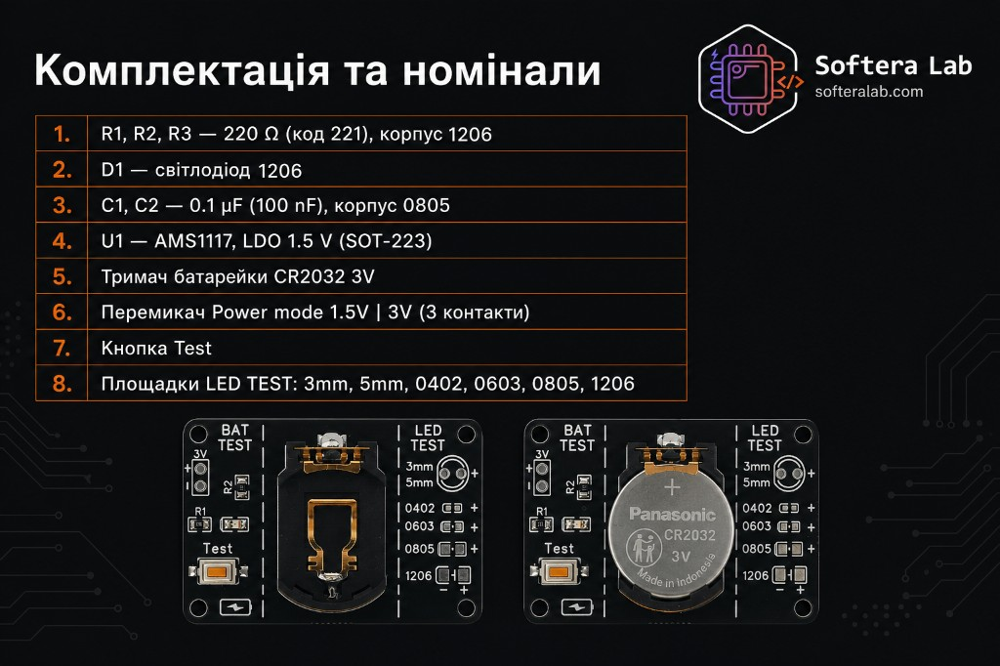
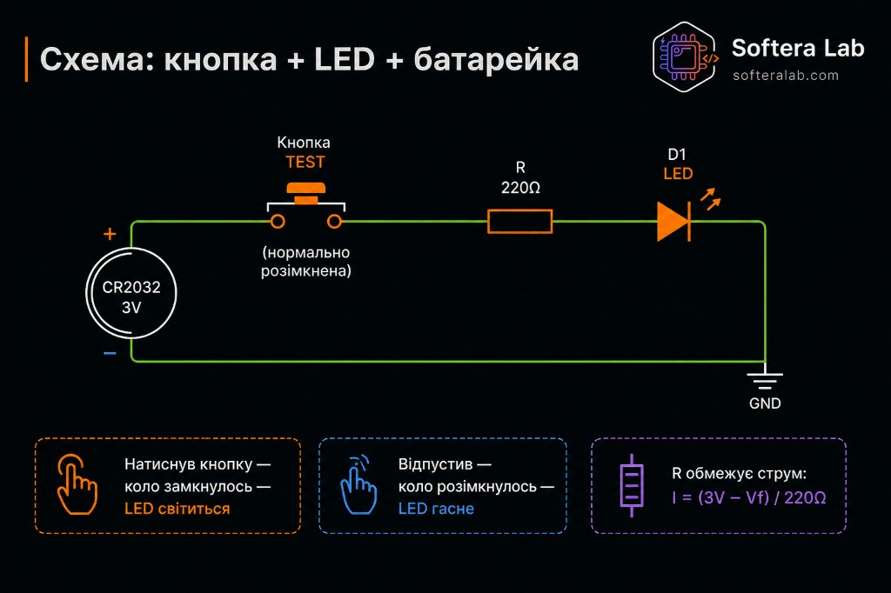
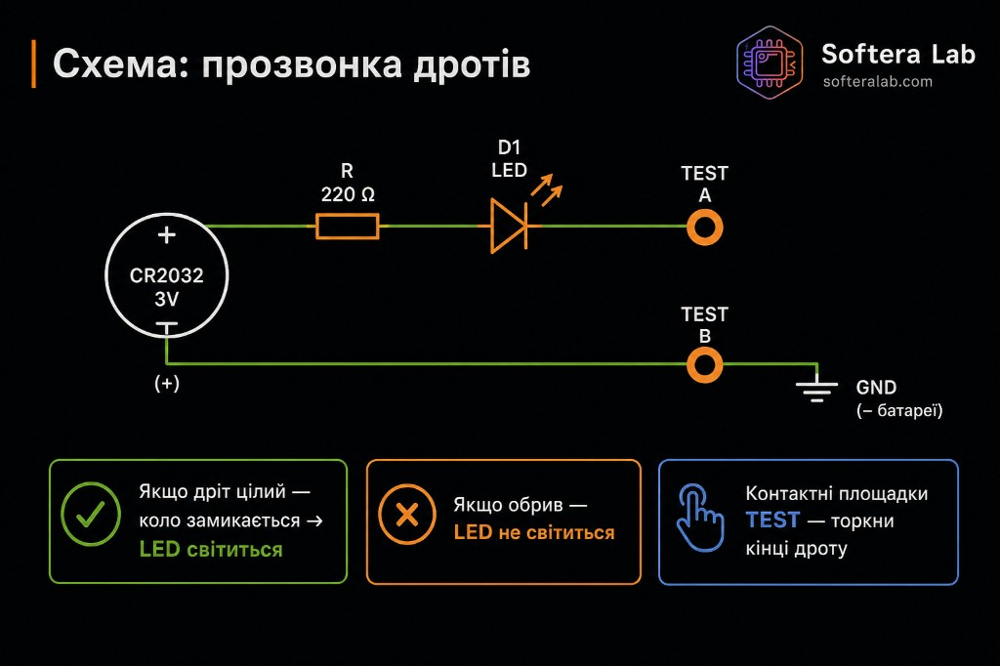
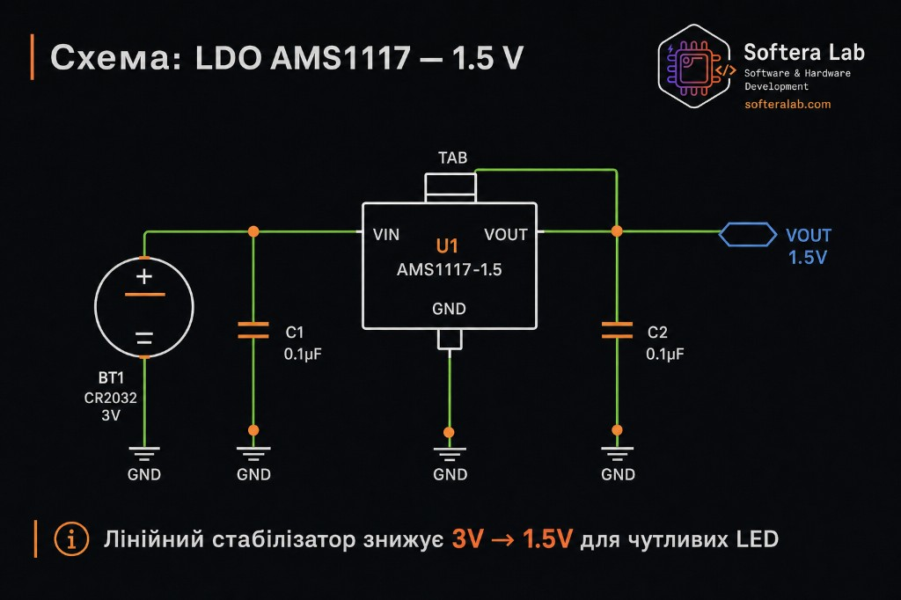
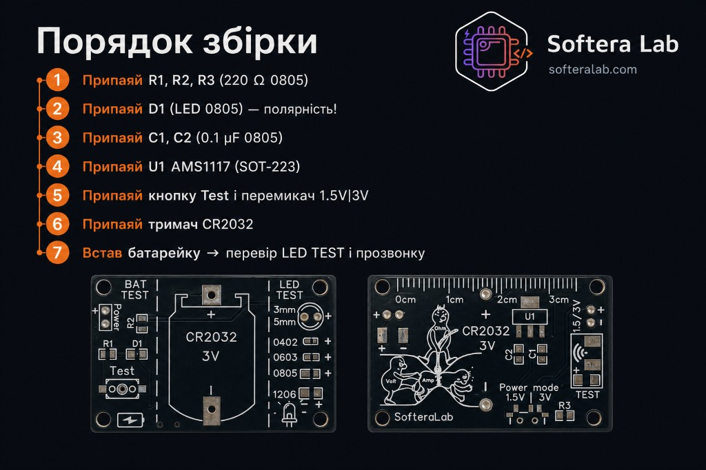

  

<h1 align="center">LED & BAT Tester · SK-15</h1>

<strong>Набір Softera Lab — тестер світлодіодів і батарейки CR2032</strong>

  
  
  
  
  

<strong>Мови:</strong> <a href="README.md">English</a> · Українська (ця сторінка)

Навчальний набір, який після збірки стає інструментом: перевірка LED, батарейки CR2032 і прозвонка дротів. Сторінка для покупця та учасників курсу пайки.

Це **не open-source проєкт**. Виробничі файли публічно не викладаються.

> © Softera Lab. All rights reserved. Копіювання плати без письмового дозволу заборонене.

## Як працює

1. **Батарейка CR2032 3V** — джерело живлення  
2. **AMS1117 LDO** — стабільні **1.5 V**  
3. **Перемикач 1.5 \| 3V** — напруга для LED TEST  
4. **Три режими** — LED TEST · прозвонка · кнопка + LED  

## Про набір

**Solder-Kit-SMD-Led-Tester-SK15** — двостороння плата [Softera Lab](https://www.softeralab.com/).

| Зона | Що є |
| --- | --- |
| **BAT TEST** | R1, R2, D1, кнопка Test, контакти 3V +/- |
| **LED TEST** | Площадки THT **3 mm / 5 mm** і SMD **0402, 0603, 0805, 1206** (полярність +) |
| **Живлення** | Тримач CR2032, AMS1117-1.5, перемикач 1.5 V \| 3 V |
| **Прозвонка** | Площадки TEST на другій стороні |
| **Бонус** | Лінійка 0–3 cm на краю плати |

Мікроконтролера немає.

## Характеристики

| Параметр | Значення |
| --- | --- |
| Product | LED & BAT Tester · SK-15 |
| Повна назва | Solder-Kit-SMD-Led-Tester-SK15 |
| Живлення | CR2032, 3 V |
| Стабілізатор | AMS1117-1.5 → 1.5 V |
| Напруга LED TEST | Перемикач **1.5 V \| 3 V** |
| Площадки LED | 3 mm, 5 mm, 0402, 0603, 0805, 1206 |
| Режими | LED TEST, прозвонка, кнопка + LED |
| МК | Немає |

## Комплектація та номінали

1. **R1, R2, R3** — 220 Ω (код 221)  
2. **D1** — LED  
3. **C1, C2** — 0.1 µF (100 nF), 0805  
4. **U1** — AMS1117-1.5, LDO, SOT-223  
5. Тримач **CR2032 3V**  
6. Перемикач **1.5V \| 3V**  
7. Кнопка **Test**  
8. Площадки **LED TEST** — 3 mm, 5 mm, 0402, 0603, 0805, 1206  

Корпуси на шовкографії звіряйте з карткою комплектації вашої ревізії.

## Навчальні схеми

### Кнопка + LED + батарейка

Натиснув кнопку — коло замкнулось — LED світиться. Відпустив — гасне.  
`I = (3V − Vf) / 220Ω`

### Прозвонка дротів

Торкніться кінців дроту до площадок **TEST**. Цілий дріт — LED світиться. Обрив — не світиться.

### LDO AMS1117 — 1.5 V

Лінійний стабілізатор знижує **3V → 1.5V** для чутливих LED (з C1 / C2 0.1 µF).

## Збірка коротко

Повний порядок: [docs/02-getting-started.md](docs/02-getting-started.md).

1. Припаяй **R1, R2, R3** (220 Ω)  
2. Припаяй **D1** (LED) — **полярність!**  
3. Припаяй **C1, C2** (0.1 µF)  
4. Припаяй **U1 AMS1117** (SOT-223)  
5. Припаяй кнопку **Test** і перемикач **1.5V\|3V**  
6. Припаяй тримач **CR2032**  
7. Встав батарейку → перевір **LED TEST** і прозвонку  

## Посилання

| Матеріал | Де |
| --- | --- |
| English README | [README.md](README.md) |
| Огляд плати | [docs/01-hardware-overview.md](docs/01-hardware-overview.md) |
| Збірка | [docs/02-getting-started.md](docs/02-getting-started.md) |
| Користування | [docs/03-usage.md](docs/03-usage.md) |
| Несправності | [docs/04-troubleshooting.md](docs/04-troubleshooting.md) |
| Курс пайки | [сторінка курсу](https://www.softeralab.com/course-basic-soldering/) |
| Контакти | [Контакти](https://www.softeralab.com/our-contacts/) · support@softeralab.com |
| Instagram | [instagram.com/softeralab](https://www.instagram.com/softeralab/) |
| YouTube | [youtube.com/@SofteraLab](https://www.youtube.com/@SofteraLab) |

## Авторське право

© Softera Lab. All rights reserved.

Публічні матеріали можна переглядати. Копіювати чи виготовляти плату без письмового дозволу Softera Lab заборонено.
