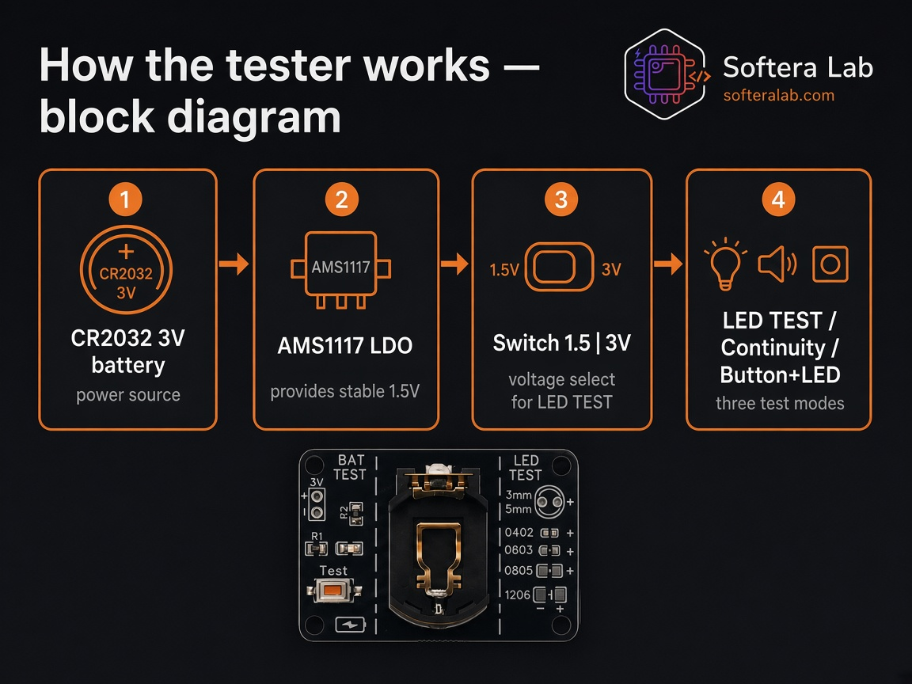
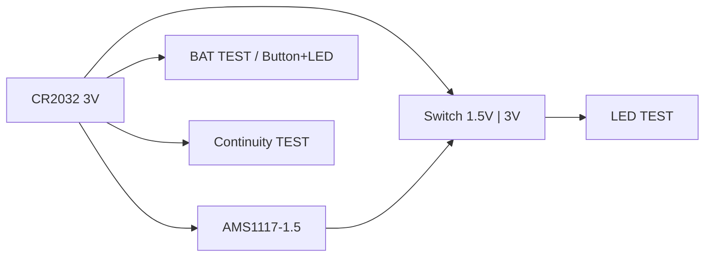
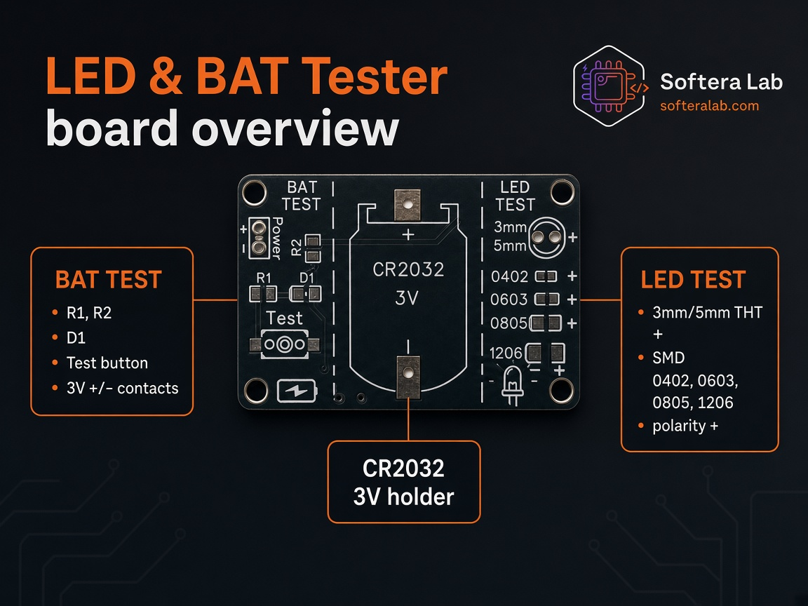
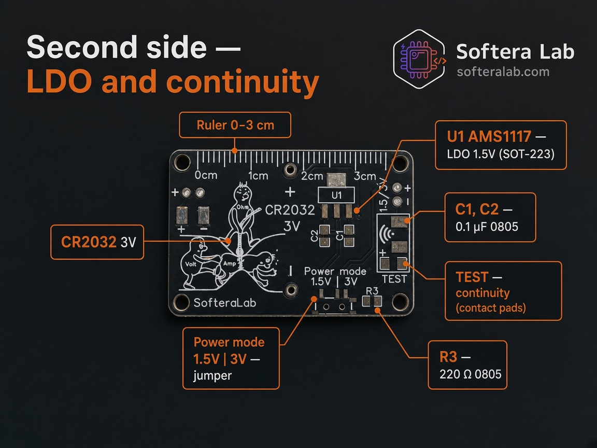
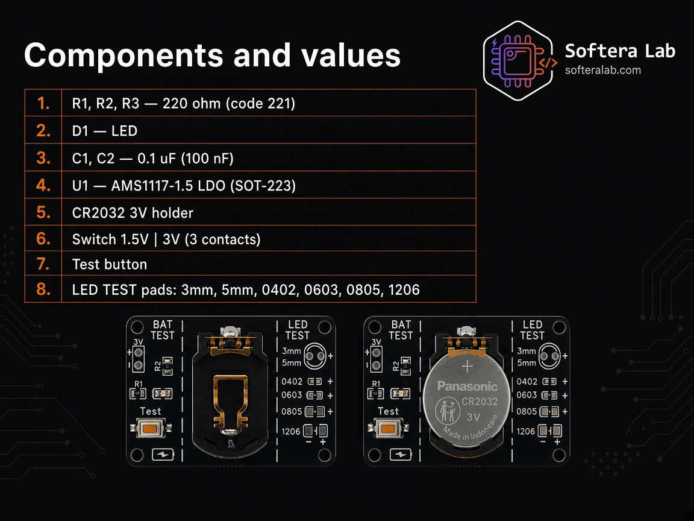

Hardware

# Board overview

**LED & BAT Tester · SK-15** (`Solder-Kit-SMD-Led-Tester-SK15`) is a soldering practice board that becomes a pocket tester after assembly.

## Power path

| Block | Role |
| --- | --- |
| CR2032 3V | Main supply |
| AMS1117-1.5 | Stable 1.5 V for sensitive LEDs |
| Switch 1.5 V \| 3 V | Selects LED TEST voltage |
| Modes | LED TEST, continuity, Button + LED |

## Front side

| Zone | Contents |
| --- | --- |
| Center | CR2032 3V holder, polarity + / − |
| BAT TEST | R1, R2, D1, Test button, 3V +/- pads |
| LED TEST | 3 mm, 5 mm, 0402, 0603, 0805, 1206 pads with + marks |

## Back side

| Zone | Contents |
| --- | --- |
| U1 | AMS1117 LDO 1.5 V, SOT-223 |
| C1, C2 | 0.1 µF, 0805 |
| R3 | 220 Ω |
| Power mode | Switch 1.5 V \| 3 V |
| TEST | Continuity pads |
| Edge | Ruler 0–3 cm |

## Bill of materials (kit card)

| Ref | Value / part | Notes |
| --- | --- | --- |
| R1, R2, R3 | 220 Ω (221) | Current limit |
| D1 | LED | Observe polarity |
| C1, C2 | 0.1 µF | LDO support |
| U1 | AMS1117-1.5 | SOT-223 |
| — | CR2032 holder | 3 V |
| — | Slide switch | 1.5 V \| 3 V |
| — | Test button | Momentary |
| LED TEST | Pads | THT + SMD sizes above |

:::caution Intellectual property
Public docs describe how to use the purchased kit. KiCad / Gerber files are not part of this repository.
:::
