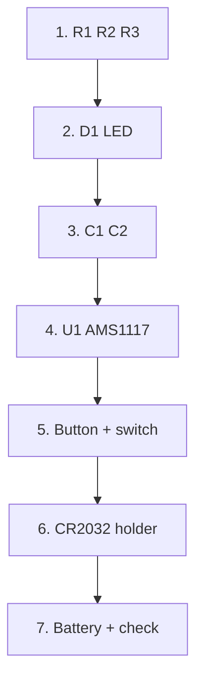

Build

# Assembly

Follow the kit card order. Smaller passives first, then the LDO, then mechanical parts.

## Tools

- Soldering iron ~300–350 °C, fine tip  
- Antistatic tweezers  
- Flux and thin solder (0.3–0.5 mm)  
- IPA for cleaning  
- Board stand  

## Steps

| Step | Action |
| --- | --- |
| 1 | Solder **R1, R2, R3** — 220 Ω |
| 2 | Solder **D1** LED — **polarity** |
| 3 | Solder **C1, C2** — 0.1 µF |
| 4 | Solder **U1 AMS1117** — SOT-223 |
| 5 | Solder **Test** button and **1.5V\|3V** switch |
| 6 | Solder **CR2032** holder |
| 7 | Insert battery → check **LED TEST** and continuity |

:::caution LED polarity
Wrong D1 orientation leaves BAT TEST dark. Match the silkscreen mark before soldering the second pad.
:::

:::info After step 7
Use [usage](./03-usage.md) for LED TEST voltage selection and continuity pads. If something fails, open [troubleshooting](./04-troubleshooting.md).
:::
